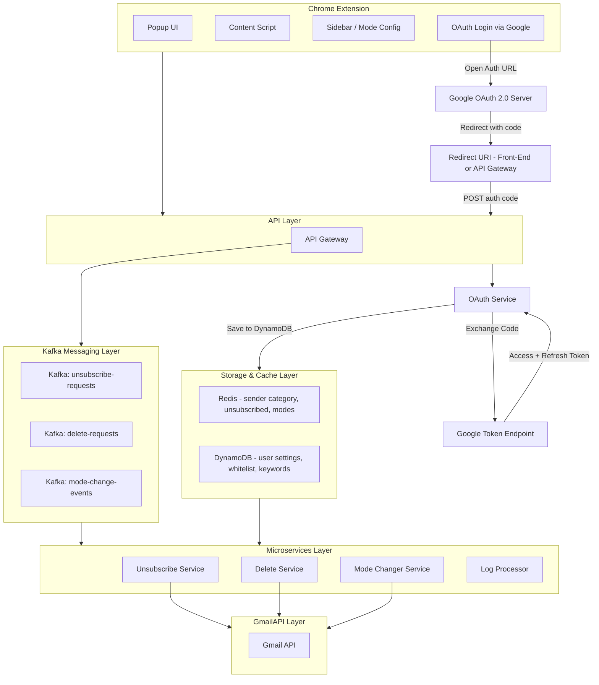

# 📄 Technical Design Document – Kick Your Ads: Chrome Gmail Extension

## 1. 🌐 Overview

Kick Your Ads is a Chrome extension designed to help users manage Gmail promotional emails by classifying, deleting, and unsubscribing from them. It supports custom "modes" such as Work Mode, Shopping Mode, and Job Hunting Mode. The system is built for scalability with:

- **Google OAuth & Gmail API**
- **Redis** for caching classification & unsubscribe status
- **Kafka (self-hosted or AWS MSK)** for decoupled, event-driven task processing
- **DynamoDB** for user-specific configuration and mode settings


## 2. System Design




## 3. 📦 Component Breakdown

### Chrome Extension (Client)
| Component            | Description |
|----------------------|-------------|
| **Popup UI**         | Provides access to summary, triggers delete/unsubscribe/mode switch |
| **Sidebar**          | Advanced mode management and white/blacklist settings |
| **Content Script**   | Parses Gmail DOM, flags emails using user-defined rules |
| **OAuth Login**      | Uses Google OAuth to obtain access_token for Gmail API |


### API Gateway

- Handles token authentication and rate limiting
- Interfaces with Gmail API using delegated user tokens
- Pushes Kafka events for background jobs
- Queries Redis for cached classification results
- Reads/Writes user settings in DynamoDB


## 4. 🔁 Event Pipeline (Kafka Topics)

| Topic Name            | Payload                                 | Purpose                            |
|-----------------------|-----------------------------------------|-------------------------------------|
| `unsubscribe-requests`| `{ userId, senderEmail, messageIds[] }` | Trigger unsubscribe link or List-Unsubscribe |
| `delete-requests`     | `{ userId, senderEmail, threadIds[] }`  | Bulk delete from Gmail inbox       |
| `mode-change-events`  | `{ userId, modeId, whitelist[], color, keywords[] }` | Update user preferences and UI settings |


## 5. ⚡ Redis Cache Design

| Key Format                      | Value              | TTL   | Purpose                                |
|---------------------------------|--------------------|-------|----------------------------------------|
| `unsubscribed:{userId}:{email}`| `true/false`       | 24h   | Avoid duplicate unsubscribe attempts   |
| `categorized:{userId}:{email}` | `"shopping"`       | 12h   | Cached classification results          |
| `mode:{userId}:{modeId}`       | Mode object (JSON) | none  | Active user-defined mode config        |


## 6. 🧾 DynamoDB Schema (User Settings)

```plaintext
Table: UserSettings
Partition Key (PK): userId
Sort Key (SK): modeId (e.g. "work", "shopping")

Attributes:
- whitelist: string[]
- keywords: string[]
- color: string
- lastUpdated: ISO8601 timestamp
```


## 7. 🧠 Mode Changer Service

| Feature                        | Details |
|--------------------------------|---------|
| **Whitelist by domain/email** | Users can enter trusted sender addresses |
| **Keyword-based classification** | Filter emails via custom keywords |
| **Custom UI theme per mode**  | Inject background color or theme to Gmail DOM |
| **Cache + DB Sync**           | Stores in Redis for fast access, persists in DynamoDB |

Triggered by `mode-change-events` Kafka topic.


## 8. 🧪 Scalability Considerations

| Layer         | Consideration |
|---------------|---------------|
| **Redis**     | Read-heavy, ideal for caching mode config and email metadata |
| **Kafka**     | Supports task decoupling, failure recovery, and batching |
| **DynamoDB**  | Serverless, auto-scaling, ideal for storing user configurations |
| **Gmail API** | Use OAuth token per user, consider rate limiting and batch API calls |

